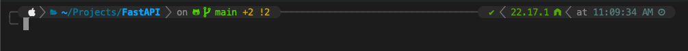

<div align="center">

# promptly

### Your terminal prompt, set up in one command.

*Stop configuring. Start coding.*



</div>

---

Most developers spend hours getting their terminal right — installing Oh My Zsh, hunting for a theme, wiring up plugins, tweaking configs — only to do it all over again on the next machine.

**promptly** does it in under a minute, on any machine, with a single command.

You get git status, language version segments (Node, Python, Go, Rust and more), syntax highlighting, autosuggestions, and execution time — all pre-configured and ready to go. Pick exactly the segments you want from an interactive checklist. No Nerd Font? No problem — promptly detects what your terminal can render and adapts automatically.

---

## Install

### macOS / Linux / WSL2

```bash
bash <(curl -fsSL https://raw.githubusercontent.com/SubhajitSarkar/promptly/main/install.sh)
```

> No git clone needed. Paste and run.

### Windows (PowerShell 7+)

```powershell
irm https://raw.githubusercontent.com/SubhajitSarkar/promptly/main/install.ps1 | iex
```

### Or clone and run

```bash
# macOS / Linux / WSL
git clone git@github.com:SubhajitSarkar/promptly.git
cd promptly
bash install.sh
```

```powershell
# Windows (PowerShell 7+)
git clone git@github.com:SubhajitSarkar/promptly.git
cd promptly
.\install.ps1
```

---

## What you get

| Platform                      | Prompt engine       |
| ----------------------------- | ------------------- |
| macOS                         | Powerlevel10k (zsh) |
| Linux (apt/dnf/pacman/zypper) | Powerlevel10k (zsh) |
| WSL2                          | Powerlevel10k (zsh) |
| Windows (PowerShell 7+)       | Oh My Posh          |

### macOS / Linux / WSL

- zsh (if not already installed)
- Oh My Zsh
- Plugins: `zsh-autosuggestions`, `zsh-syntax-highlighting`, `zsh-nvm`, `z`, `npm`
- Powerlevel10k theme with a full stack config

### Windows

- PowerShell 7 (if on PS5)
- Oh My Posh
- PSReadLine (syntax highlighting + autosuggestions)
- Terminal-Icons (file icons in `ls` output)

---

## Do you need this?

**Yes, if:**

- You want a prompt that shows git branch, status, and language versions automatically
- You set up new machines regularly and want a repeatable one-command install
- You want syntax highlighting and autosuggestions without manual plugin wiring
- You've been meaning to sort out your terminal for months and just want it done

**No, if:**

- You already have a prompt setup you are happy with
- You prefer to hand-craft your shell config
- You are on a locked-down machine where you cannot install packages _(though promptly handles this gracefully — see [Re-run safety](#re-run-safety))_

---

## Interactive segment picker

During install, promptly shows a checklist — use arrow keys and space to pick exactly the segments you want on your prompt. Nothing is forced on you.

| Segment                                                 | Shows when                              | On by default |
| ------------------------------------------------------- | --------------------------------------- | :-----------: |
| `node` / `nvm`                                          | Inside a JS/TS project                  | ✔             |
| `python` / `virtualenv`                                 | Python version active or venv activated | ✔             |
| `go`                                                    | Inside a Go project (`go.mod`)          | ✔             |
| `rust`                                                  | Inside a Rust project (`Cargo.toml`)    | ✔             |
| `execution time`                                        | Command took > 3 seconds                | ✔             |
| `time`                                                  | Always (right side)                     | ✔             |
| `ruby`, `java`, `php`, `dotnet`, `swift`                | Inside matching projects                | ✗             |
| `aws`, `azure`, `gcp`, `docker`, `terraform`, `kubectl` | When cloud/devops tools are active      | ✗             |
| `battery`, `disk_usage`, `ram`, `load`, `vpn`           | System conditions                       | ✗             |

See **[docs/SEGMENTS.md](docs/SEGMENTS.md)** for the full list and how to add your own.

---

## No Nerd Font? No problem.

promptly asks what your terminal can actually render and adapts:

1. **Nerd Font** — full icon set (recommended, see [docs/FONT_SETUP.md](docs/FONT_SETUP.md))
2. **Emoji** — 🐍 ☁ 🐳 ⚙ — works on any modern terminal with no font install
3. **Unicode** — ⬡ ☸ ○ — plain symbols, broadest compatibility
4. **ASCII** — `[node]` `[py]` `[k8s]` — works everywhere, guaranteed

The font is never a hard requirement. The prompt works at every level.

---

## After install

1. macOS / Linux / WSL: `source ~/.zshrc` or open a new terminal
2. Windows: `. $PROFILE` or open a new terminal
3. Want to change your prompt style? Run `p10k configure` anytime

---

## Re-run safety

Both scripts are fully idempotent — safe to re-run on the same machine. They will:

- Skip already-installed components
- Back up existing configs with timestamps before touching them

---

## Rollback

Backups are created automatically before anything is modified:

```
~/.zshrc.bak.<timestamp>
~/.p10k.zsh.bak.<timestamp>
$PROFILE.bak.<timestamp>          # Windows
~/.omp_config.json.bak.<timestamp> # Windows
```

To fully uninstall and restore your previous state: **[docs/UNINSTALL.md](docs/UNINSTALL.md)**

---

## Project structure

```
promptly/
├── install.sh          # Entry point — macOS / Linux / WSL
├── install.ps1         # Entry point — Windows PowerShell
├── uninstall.sh        # Uninstaller — macOS / Linux / WSL
├── uninstall.ps1       # Uninstaller — Windows PowerShell
├── lib/                # Bash modules
│   ├── logger.sh
│   ├── detect.sh
│   ├── fallback.sh
│   ├── manifest.sh
│   ├── picker.sh
│   ├── deps.sh
│   ├── omz.sh
│   ├── p10k.sh
│   ├── zshrc.sh
│   └── uninstall.sh
├── lib-ps/             # PowerShell modules
│   ├── Logger.ps1
│   ├── Detect.ps1
│   ├── Deps.ps1
│   ├── Manifest.ps1
│   ├── Picker.ps1
│   ├── OhMyPosh.ps1
│   ├── Profile.ps1
│   └── Uninstall.ps1
└── config/
    ├── icons.tsv           # Icon registry — nerd / emoji / unicode / ascii
    ├── base/
    │   ├── p10k_base.zsh   # Base Powerlevel10k layout
    │   └── omp_base.json   # Base Oh My Posh layout
    └── segments/
        ├── zsh/
        │   └── p10k/       # One .zsh file per segment (Powerlevel10k)
        └── ps/
            └── omp/        # One .json file per segment (Oh My Posh)
```

---

<div align="center">

Made for developers who want a great terminal without the yak shaving.

**[Font setup](docs/FONT_SETUP.md) · [Segments](docs/SEGMENTS.md) · [Uninstall](docs/UNINSTALL.md)**

</div>
